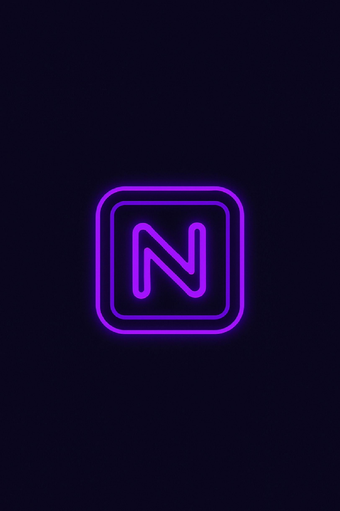

# 🌌 Neon Dark Expressive - Android Theme App

**Neon Dark Expressive** is a modern dark theme Android app designed for users who love personalization, glowing neon colors, and immersive UI vibes. Built using Expo + React Native, this app offers a smooth experience with fully dynamic theme switching and custom components. 🎨

> ⚡ Stylish, minimal, and eye-friendly.

---

## 🚀 Features / Özellikler

- 🔮 **Dark base theme** with vivid neon accents (Cyan / Magenta)
- 🎨 **Color Picker** to customize primary theme color
- ⚡ **Custom NeonButton** with glowing animation style
- 🔁 **Theme persistence** using AsyncStorage
- 🌈 **Live Theme Context System**
- 📱 Custom **App Icon** and **Splash Screen**
- 🛠️ Built with **Expo + EAS Build** for easy deployment

---

## 📸 Preview / Önizleme



---

## 🛠️ Technologies

- React Native (Expo)
- React Navigation
- AsyncStorage
- Wheel Color Picker
- Custom Context API
- Expo EAS Build

---

## 📦 Build

```bash
eas build -p android --profile preview

npm install
npx expo start

🌟 Why This App?
“Your phone, your style.”
With Neon Dark Expressive, personalization meets visual power. Whether you're a fan of clean minimalism or retro neon glow, this theme gives your device the vibe it deserves.

🧠 Roadmap Ideas
 Lottie animation integration

 Dynamic font & text size selector

 KWGT/Nova Launcher export feature

 In-app store for premium themes

🤝 Contributions
Pull requests are welcome!
Feel free to open issues or suggest features 🚀

---

### 📥 Download APK

You can try the app on your Android device by downloading the latest build:

👉[Download Neon Dark Expressive APK](https://expo.dev/accounts/seranodanwow/projects/neon-theme-app/builds/432db58d-8033-410a-8c39-dae674804573)

> Note: Make sure to enable **"Install from unknown sources"** on your device.


📜 License
This project is licensed under the MIT License.

👨‍💻 Developed by Ahmet ŞEN (@ahmtub)
Inspired by 2025's most expressive UI trends. Made with ❤️ using React Native + Expo.